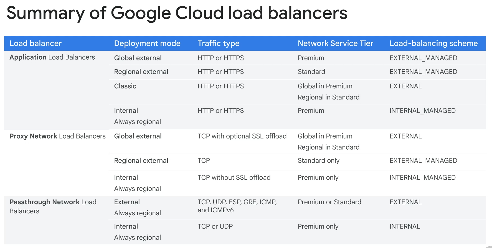

# Google GCP Training
## Week 1: Getting Started - Cloud Resources

### Enable Cloud Run API  
```bash
gcloud services enable run.googleapis.com
```

### Useful Listing Commands
```bash
gcloud auth list
gcloud config list project                  # Config for current project
gcloud config list                          # Environment Config
gcloud components list
```

### Setting Region & Zone
```bash
gcloud config get compute/region            # Get Region
gcloud config set compute/region us-east4   # Set Region

gcloud config get compute/zone              # Get Zone
gcloud config set compute/zone us-east4-a   # Set Zone

# You may find it useful to store as environment variables
export REGION=us-east4
export ZONE=us-east4-a

# Create a compute instance within the ZONE
gcloud compute instances create gcelab2 --machine-type e2-medium --zone=$ZONE

# Extract project ID and Zone from gcloud config
export PROJECT_ID=$(gcloud config get-value project)
export ZONE=$(gcloud config get-value compute/zone)
```

### Defaults (Help) & Filtering Command Outputs
```bash
# View Defaults for new VM creation
gcloud compute instances create --help

# Filtering Outputs
gcloud compute instances list --filter="name=('gcelab2')"
gcloud compute firewall-rules list --filter="NETWORK:'default' AND ALLOW:'icmp'" # Default network and allow icmp
```

### SSH & RDP
Connect to VM from cloud shell or terminal
```bash
# Via SSH, e.g. 'unix
gcloud compute ssh [instance] --zone=$ZONE

# Via RDP, e.g. windows
gcloud compute reset-windows-password [instance] --zone [zone] --user [username] # Set a password 
gcloud compute instances get-serial-port-output [instance] # Connect, wait for "Instance setup finished. [instance] is ready to use."

# RDP Password reset example
gcloud compute reset-windows-password instance-20240227-110120 --zone us-east1-d --user admin

  This command creates an account and sets an initial password for the
  user [admin] if the account does not already exist.
  If the account already exists, resetting the password can cause the
  LOSS OF ENCRYPTED DATA secured with the current password, including
  files and stored passwords.

  For more information, see:
  https://cloud.google.com/compute/docs/operating-systems/windows#reset

  Would you like to set or reset the password for [admin] (Y/n)?  Y

  Resetting and retrieving password for [admin] on [instance-20240227-110120]
  Updated [https://www.googleapis.com/compute/v1/projects/qwiklabs-gcp-02-89b9c6e88175/zones/us-east1-d/instances/instance-20240227-110120].
  ip_address: 34.148.110.138
  password:   kC9*9EF[YVY+~4E
  username:   admin
```

## Firewall
TODO Scope of firewall rules
```bash
gcloud compute firewall-rules list
gcloud compute firewall-rules list --filter="network='default'" # Default network
gcloud compute firewall-rules list --filter="NETWORK:'default' AND ALLOW:'icmp'" # Default network and allow icmp

# Allow HTTP traffic for tagged instances (http-server, https-server)
gcloud compute instances add-tags gcelab2 --tags http-server,https-server
gcloud compute firewall-rules create default-allow-http --direction=INGRESS --priority=1000 --network=default --action=ALLOW --rules=tcp:80 --source-ranges=0.0.0.0/0 --target-tags=http-server
gcloud compute firewall-rules list --filter=ALLOW:'80' # Check our working
curl http://$(gcloud compute instances list --filter=name:gcelab2 --format='value(EXTERNAL_IP)') # Test

# Apply a firewall rule to resources tagged with network-lb-tag
gcloud compute firewall-rules create www-firewall-network-lb --target-tags network-lb-tag --allow tcp:80
```

## IP Addresses
```bash
# Create new static IP. These need to be in the same region as they'll be used
gcloud compute addresses create network-lb-ip-1 --region us-east1

# Create a health check
gcloud compute http-health-checks create basic-check 

# Create a target pool attaching our helath check
gcloud compute target-pools create www-pool --region us-east1 --http-health-check basic-check 

# Add instances to target pool, in this case they're VMs www1, www2, www3
gcloud compute target-pools add-instances www-pool --instances www1,www2,www3 

# Add forwarding rule
gcloud compute forwarding-rules create www-rule --region us-east1 --ports 80 --address network-lb-ip-1 --target-pool www-pool 
```

## Tagging Instances
```bash
gcloud compute instances add-tags [instance] --tags [tag1],[tag2],..
```

## System Logging
```bash
gcloud logging logs list
gcloud logging logs list --filter="compute" # Compute logs
gcloud logging read "resource.type=gce_instance" --limit 5 # Read gce_instance logs
gcloud logging read "resource.type=gce_instance AND labels.instance_name='gcelab2'" --limit 5 # Read gce_instance logs for a specific VM
```

## K8s
```bash
gcloud container clusters create --machine-type=e2-medium --zone=us-east1-d lab-cluster
gcloud container clusters get-credentials lab-cluster # Get credentials for kubectl
kubectl create deployment hello-server --image=gcr.io/google-samples/hello-app:1.0 # Deploy sample Hello World deployment
kubectl expose deployment hello-server --type=LoadBalancer --port 8080 # Expose deployment behind load balancer
```

## Creating a VM with a Startup Script
We pass in the startup script to run on the VM creation
```bash
  gcloud compute instances create www1 \
    --zone=us-east1-d \
    --tags=network-lb-tag \
    --machine-type=e2-small \
    --image-family=debian-11 \
    --image-project=debian-cloud \
    --metadata=startup-script='#!/bin/bash
      apt-get update
      apt-get install apache2 -y
      service apache2 restart
      echo "
<h3>Web Server: www1</h3>" | tee /var/www/html/index.html'
```

Output of creating a standard VM
```bash
student_00_012bc7f82443@cloudshell:~ (qwiklabs-gcp-00-3e1e1a363c2a)$ export ZONE=us-east4-a
student_00_012bc7f82443@cloudshell:~ (qwiklabs-gcp-00-3e1e1a363c2a)$ gcloud compute instances create gcelab2 --machine-type e2-medium --zone=$ZONE
Created [https://www.googleapis.com/compute/v1/projects/qwiklabs-gcp-00-3e1e1a363c2a/zones/us-east4-a/instances/gcelab2].
NAME: gcelab2
ZONE: us-east4-a
MACHINE_TYPE: e2-medium
PREEMPTIBLE: 
INTERNAL_IP: 10.150.0.3
EXTERNAL_IP: 34.86.181.180
STATUS: RUNNING
student_00_012bc7f82443@cloudshell:~ (qwiklabs-gcp-00-3e1e1a363c2a)$ 
```

## Storage Buckets
```bash
# Create a bucket
gcloud storage buckets create -l $LOCATION gs://$DEVSHELL_PROJECT_ID
gcloud storage buckets create gs://myuniquebucketname # Create a bucket with a unique name

# Download File Locally
gcloud storage cp gs://cloud-training/gcpfci/my-excellent-blog.png my-excellent-blog.png

# Push file to bucket
gcloud storage cp my-excellent-blog.png gs://$DEVSHELL_PROJECT_ID/my-excellent-blog.png

# Modify ACL so it's readable by everyone
gsutil acl ch -u allUsers:R gs://$DEVSHELL_PROJECT_ID/my-excellent-blog.png
```


## Create & Manage Cloud Resources Lab
https://www.cloudskillsboost.google/course_sessions/11837914/labs/423778  
Note: On this task the zone, region and some IDs change each time, so be aware of copy/pasting commands

```bash
# Set default region & zone
gcloud config set compute/region us-west1
gcloud config set compute/zone us-west1-c

# 1. Create VM
gcloud compute instances create nucleus-jumphost-763 --zone=us-west1-c --machine-type=e2-micro

# 2. Create a Kubernetes service cluster
gcloud container clusters create --machine-type=e2-micro --zone=us-west1-c lab-cluster
gcloud container clusters get-credentials lab-cluster
kubectl create deployment hello-app --image=gcr.io/google-samples/hello-app:2.0
kubectl expose deployment hello-app --type=LoadBalancer --target-port=8082 --port=8082
kubectl get services # Check for exposed IP

# 3. Set up an HTTP load balancer
## Create an instance template
gcloud compute instance-templates create nginx-template2 --machine-type=e2-medium --region=us-west1 --network=default --subnet=default --tags=allow-health-check --image-family=debian-11 --image-project=debian-cloud --metadata=startup-script="#! /bin/bash
apt-get update
apt-get install -y nginx
service nginx start
sed -i -- 's/nginx/Google Cloud Platform - '\"\$HOSTNAME\"'/' /var/www/html/index.nginx-debian.html"

## Create target pool
gcloud compute target-pools create www-pool --region=us-west1

## Create a managed instance group
gcloud compute instance-groups managed create nginx-group --template=nginx-template2 --size=2 --zone=us-west1-a

## Create a firewall rule
gcloud compute firewall-rules create grant-tcp-rule-720 --direction=INGRESS --priority=1000 --network=default --action=ALLOW --rules=tcp:80 --source-ranges=0.0.0.0/0

## Create a healthcheck
gcloud compute http-health-checks create http-basic-check

## Load Balancer Health Check
gcloud compute health-checks create http http-basic-check --port 80

## Create backend service
gcloud compute backend-services create web-backend-service \
  --protocol=HTTP \
  --port-name=http \
  --health-checks=http-basic-check \
  --global

## Add instance group to backend service
gcloud compute backend-services add-backend web-backend-service \
  --instance-group=nginx-group \
  --instance-group-zone=us-west1-a \
  --global

## Create a URL map, and target the HTTP proxy to route requests to your URL map.
gcloud compute url-maps create web-map-http --default-service web-backend-service
gcloud compute target-http-proxies create http-lb-proxy --url-map web-map-http

## Create forwarding rule
gcloud compute addresses create lb-ipv4-1 \
  --ip-version=IPV4 \
  --global

gcloud compute forwarding-rules create http-content-rule \
   --address=lb-ipv4-1\
   --global \
   --target-http-proxy=http-lb-proxy \
   --ports=80

## I then manually assigned the http-basic-check and named port http=80 to the backend service in gcp web console and it worked
```


# Week 2: ...
## Persistent State Within Cloud Shell
```bash
student_03_fb000e1c3fc2@cloudshell:~ (qwiklabs-gcp-03-fd337d0c1fb0)$ cat infraclass/config 
INFRACLASS_REGION=us-west4
INFRACLASS_PROJECT_ID=qwiklabs-gcp-03-fd337d0c1fb0

student_03_fb000e1c3fc2@cloudshell:~ (qwiklabs-gcp-03-fd337d0c1fb0)$ cat .profile 
if [ -n "$BASH_VERSION" ]; then
  if [ -f "$HOME/.bashrc" ]; then
    . "$HOME/.bashrc"
  fi
fi

source infraclass/config  # <-- Load our config
```

## Marketplace
Google Cloud Marketplace lets you quickly deploy functional software packages by providing pre-defined templates with the "Deployment Manager" Google Cloud service?


# Service Accounts
"Compute Engine Default Service Account" is the default service account for Compute Engine VMs. It's used to authenticate the VMs to other Google Cloud services.

Can't sign in to the VM using the service account, but can use it to authenticate to other Google Cloud services.

Permits access to APIs and services, and can be used to authenticate to any service that supports service accounts. When creating an instance you can specify the APIs a service account can access.

The service account identity is the same for each VM in a project, but the permissions can be different.

## Custom Service Accounts
IAM roles with service accounts. Central management of access permissions enhances security.

# Logging & Monitoring
## Ops Agent
Ops Agent is a Google Cloud service that collects logs and metrics from your VMs and sends them to Cloud Monitoring and Cloud Logging. It's a lightweight agent that runs on your VMs and sends logs and metrics to Cloud Monitoring and Cloud Logging.

Cost varies by the number of VMs and the amount of data collected.

It's an optional setting that can be enabled when creating an instance.

# VMs
- Up to 128 disks per VM, up to 64 TB per disk


# Virtual Networks
## VPC - Virtual Private Cloud
### Objects
- Projects
- Networks
- Subnetworks
- Regions
- Zones
- IP Addresses (Internal, external, ranges)
- VMs
- Routes
- Firewall Rules

#### Projects & Networks
##### A Project:
- associates objects & services with billing.
- contains networks (up to 15) that can be shared/peered. This is a quota but can request an increase in console.

##### A Network:
- Has no IP address range
- Is global and spans all available regions
- Contains subnetworks
- Is available as default, auto or custom.
  - Default
    - Every Project
    - One subnet per region
    - Default firewall rules

  - Auto mode
    - Default network
    - One subnet per region
    - Regional IP allocation (Each region gets it's own subnet)
    - Fixed /20 subnetwork per region
    - Expandable up to /16

  - Custom mode
    - No default subnets created
    - Full control of IP ranges
    - Regional IP allocation
    - Expandable to IP ranges you specify

  You can convert an auto mode network to a custom mode network. But can't be done in reverse.

##### Subnetworks cross zones
- VMs can be on the same subnet but in different zones
- A single firewall rule can apply to both VMs

##### Expand subnets without re-creating instances
- Cannot overlap with other subnets
- IP range must be a unique valid CIDR block
- New subnet IP ranges have to fall within valid IP ranges
- Can expand but not shrink
- Auto mode can be expanded from /20 to /16

#### IP Addresses
- Internal
  - RFC 1918
  - Allocated from subnet range to VMs by DHCP
  - DHCP lease is renewed every 24 hours
  - VM Name + IP is registered with network-scoped DNS
- External (Optional)
  - Assigned from pool (ephemeral)
  - Reserved (static)
  - Bring Your Own IP Address (BYOIP)
    - Must be /24 or larger
  - VM doesn't know external IP, it's NAT'd
  - Unused reserved (static) IPs are charged at a higher rate than those in use


#### DNS
##### DNS Resolution for Internal Addresses
Google Cloud has two types of internal DNS:
  - Zonal
  - Global

Each instance has a hostname that can be resolved to an internal IP address:
  - The hostname is the sae as the instance name
  - FQDN is [hostname].[zone].c.[project-id].internal
  - e.g. my-server.us-central1-c.guestbook-121617.internal

Name resolution is handled by internal DNS resolver:
  - Provided as part of Compute Engine
  - Configured for use on instance via DHCP
  - Provides answer for internal and external addresses

DNS name always points to internal instance, even if IP changes.

##### DNS Resolution for External Addresses
Instances with external IP addresses can allow connections from hosts outside the project
  - Users connect directly using external IP address
  - Admins can publish public DNS records pointing to the instance
    - Public DNS records are not published automatically

DNS records for external addresses can be published using existing DNS servers (outside GCP)  
DNS zones can be hosted using Cloud DNS (A managed service in GCP)

##### Other Notes
GCP allows a range of IP addresses to be assigned as aliases to a VM network interface
  - Useful if running multiple services on a single host and want each service to be on a different IP address

#### Routes & Firewall Rules
- If all rules are deleted, there is:
  - An implied `deny all` ingress rule
  - An implied `allow all` egress rules

A firewall rule is composed of:  
| Parameter | Description |
| --- | --- |
| Direction | Inbound connections are matched against `ingress` rules only. Outbound connections are matched against `egress` rules only. |
| Source or Dest | For the `ingress` direction, `sources` can be specified as part of the rule with IP addresses, source tags or a source service account. For the `egress` direction, `destinations` can be specified as part of the rule with one or more ranges of IP addresses. |
| Port **and** protocol | Any rule can be restricted to apply to specific protocols only or specifiec combinations of protocols and ports only. |
| Action | To allow or deny packets that match the direction, protocol, port, and source or destination of the rule |
| Priority | Govers the order in which rules are evaluated; The first matching rule is applied |
| Rule Assignment | All rules are assigned to all instances, but you can assign certain rules to certain instances only |


#### Negwork Pricing
- Ingress is free
- Exgress to the same zone (internal ip address) is free
- Egress to google products (Youtube, Maps, Drive) or a different GC service (within same region) is free
- Egress between zones in the same region is charged per GB
- Egress to the same zone (external IP address) is charged per GB
- Egress between regions is charged (Variable)

##### External IP Address Pricing (Subject to change)
- Static IP addresses are charged if not in use ($0.010/hour)
- Static & Ephemeral IP addresses in use on standard VM instances ($0.004/hour)
- Static & Ephemeral IP addresses in ue on preemptible VM instances ($0.002/hour)
- Static & Ephemeral IP addresses attached to forwarding rules, used by Cloud NAT and Cloud VPN tunnel (no charge)

##### Creating Networks in CLI
```bash
gcloud compute networks create [name] --subnet-mode=custom
gcloud compute networks subnets create [name] --network=[network] --region=[region] --range=[subnet]

## e.g. gcloud compute networks subnets create privatesubnet-us --network=privatenet --region=us-west1 --range=172.16.0.0/24

# View available networks
gcloud compute networks list
gcloud compute networks list --sort-by=NETWORK

# Create Firewall Rules
gcloud compute firewall-rules create privatenet-allow-icmp-ssh-rdp --direction=INGRESS --priority=1000 --network=privatenet --action=ALLOW --rules=icmp,tcp:22,tcp:3389 --source-ranges=0.0.0.0/0 # Allow ICMP, SSH, RDP from anywhere

# View Firewall Rules
gcloud compute firewall-rules list --sort-by=NETWORK

# Create VM in a network
gcloud compute instances create privatenet-us-vm --zone=us-west1-c --machine-type=e2-micro --subnet=privatesubnet-us --image-family=debian-11 --image-project=debian-cloud --boot-disk-size=10GB --boot-disk-type=pd-standard --boot-disk-device-name=privatenet-us-vm

# View VMs by Zone
gcloud compute instances list --sort-by=ZONE
```

#### Common Network Designs
Cloud NAT provides internet access to private instances. It's a managed service that allows private instances to access the internet without a public IP address. It's useful for private instances that don't need to be directly accessible from the internet.

Private Google Access to Google APIs and services.

#### Connect to a VM over SSH through IAP (Identity-Aware Proxy)   
Note: When instances do not have external IP addresses, they can only be reached by other instances on the network via a managed VPN gateway or via a Cloud IAP tunnel. Cloud IAP enables context-aware access to VMs via SSH and RDP without bastion hosts
```bash
gcloud compute ssh vm-internal --zone us-central1-f --tunnel-through-iap
```

VM instances that have no external IP addresses can use Private Google Access to reach external IP addresses of Google APIs and services. By default, Private Google Access is disabled on a VPC network.

Private Google Access is enabled at the subnet level. When it is enabled, instances in the subnet that only have private IP addresses can send traffic to Google APIs and services through the default route (0.0.0.0/0) with a next hop to the default internet gateway.

In the Cloud Console, on the Navigation menu (Navigation menu icon), click VPC network > VPC networks.
Click privatenet to open the network.
Click privatenet-us to open the subnet.
Click Edit.
For Private Google access, select On.
Click Save.

#### Configure a Cloud NAT gateway
Although vm-internal can now access certain Google APIs and services without an external IP address, the instance cannot access the internet for updates and patches. Configure a Cloud NAT gateway, which allows vm-internal to reach the internet.

Cloud NAT is a regional resource. You can configure it to allow traffic from all ranges of all subnets in a region, from specific subnets in the region only, or from specific primary and secondary CIDR ranges only.

Note: The Cloud NAT gateway implements outbound NAT, but not inbound NAT. In other words, hosts outside of your VPC network can only respond to connections initiated by your instances; they cannot initiate their own, new connections to your instances via NAT.

#### Review
https://cloud.google.com/iap/docs/using-tcp-forwarding

You created vm-internal, an instance with no external IP address, and connected to it securely using an IAP tunnel. Then you enabled Private Google Access, configured a NAT gateway, and verified that vm-internal can access Google APIs and services and other public IP addresses.

VM instances without external IP addresses are isolated from external networks. Using Cloud NAT, these instances can access the internet for updates and patches, and in some cases, for bootstrapping. As a managed service, Cloud NAT provides high availability without user management and intervention.

IAP uses your existing project roles and permissions when you connect to VM instances. By default, instance owners are the only users that have the IAP Secured Tunnel User role.

For how to allow other users to access your VMs using IAP tunneling, see, in the Cloud Architecture Center, Grant access to additional users Guide.

### Virtual Machines
#### Availability Policy: Automatic Changes  
Called "Scheduling Options" in SDK/API

Automatic Restart
- Automatic VM restart due to crash or maintenance event
  - Not preemption or a user-initiated terminate

On Host Maintenance
- Determines whether host is live-migrated or terminated due to a maintenance event. Live migration is the default
Live Migration
- During maintenance event, VM is migratied to different hardware without interruption.
Metadata indicated occurrence of live migration.

Can be confirgued witle the option is running or stopped.

#### Patch Management is an essential part of managing infra
Manage OSes easily through GC
- Keeps infra up-to-date
- Reduces security risks

OS patch management
- Patch Compliance Reporting
- Patch Deployment

There are several tasks that can be performed with patch Management:
- Create Patch Approvals
- Set up flexible scheduling
- Apply advanced patch configuration settings
- Manage thes epatch jobs or updates from a centralized location

Charges for Stopped (terminated) VMs
- No Charge for Memory or CPU resources
- Charged for attached disks & reserved IP addresses

Actions supported on a terminated VM (But VM need not necessarily be terminated):
- Change machine type
- Migrate instance to another network
- Add or remove attached disks; change auto-delete settings
- Modify instance tags
- Modify custom VM or project-wide metadata
- Remove or set a new static IP
- Modify VM availability policy
- [X] Can not change the image of a stopped VM

#### Machine Type Structure
- Machine Family
  - -> Machine Series
    - -> Machine Type

- Machine Family
  - General Purpose
    - E2 Series
      - Cost Optimised day-to-day computing at a lower cost
      - Suited for Web/App Servers, Back office apps, Small-Medium databases, Microserices, Virtual Desktops, Dev Environments
      - Between 2 & 32 vCPUs
      - Between .5 & 8GB mem per vCPU

    - N2, N2D, N1
      - Balanced price/performance across a wide range of VM shapes
      - Suited for Web/App servers, back office apps, medium-large databases, cache, media/streaming
      - Up to 128 scaleable CPUs
      - Between .5 & 8GB mem per vCPU
      - Committed use & sustained use discounts
      - N2D utilise latest Epyc processors

    - Tau T2D, Tau T2A
      - Scale-out optimised - Best performance/cost for scale-out workloads
      - Suited for scale-out workloads, web servers, containerized microservices, media transcoding, large-scale java apps
      - Up to 60 vCPUs
      - 4GB mem per CPU


  - Compute Optimised
     - High performance per core, suited for compute intensive workloads.

    - C2
       - Ultra High performance for compute intensive workloads
       - Suited for compute-bound workloads, high performance web servers, gaming (AAA game servers), Ad serving, high performance computing (HPC), Media Transcoding, AI/ML
       - Might benefit applications with per-core licencing models due to higher performance per core

    - C2D
       - Ultra High performance for compute intensive workloads
       - Memory-bound workloads, Gaming (AAA Game servers), High performance computing (HPC), High perforance Databases, Electronic Design AUtomation (EDA), Media Transcoding
    
    - H3
      - Ultra high performance for compute intensive workloads
      - Suited for high performance computing (HPC), Electronic Design Automation (EDA)
      - DDR5 Memory
      - Intel based

  - Memory Optimised
    - M1
      - Ultra high memory workloads
      - Suited for medium in-memory DBs such as SAP HANA
      - Tasks that require intensive use of memory with higher memory-to-vCPU rations than general-purpose high-memory machine types
      - In-memory databases and in-memory analytics, business warehousing workloads, genomics analysis, SQL analysis services, Microsoft SQL Server and similar DBs

    - M2
      - Ultra high memory workloads
      - Large in memr
      - In-memory databases and in-memory analytics, business warehousing workloads, genomics analysis, SQL analysis services, Microsoft SQL Server and similar DBs
      - Up to 30% sustained use discounts, eligible for committed use discounts (Up to 60% discount for 3 year commitment)

    - M3
      - Ultra high memory workloads
      - Suited for OLAP and OLTP SAP workloads, memory intense electronic design automation
      - Up to 35GB per vCPU

  - Accelerated Computing
    - Optimised for GPU-workloads
    - A2
      - Optimised for high-performance computing workloads
      - Suited for CUDA-enabled ML training and inference, HPC, Massive parrallised computing

    - G2
      - Optimised for high performance computing workloads
      - Video transcoding, remote visualisation workstation

#### VM Pricing
- Per second billing, 1 min minimum
  - vCPU, GPU, and GB of memory

- Resource based pricing
  - Each vCPU and each GB of memory is billed separaetly

- Discounts:
  - Sustained use (Up to 30% net discount instacnces that run the entire month)
  - Committed use
  - Preemptible VM instances (can run up to 24hrs at a time)

- Recommendation Engine
  - Notifies of underutilised resources

- Free usage limits

#### Special Compute Configurations
- Preemptible VMs
  - Short-lived, low-cost instances
  - Can be terminated at any time
    - No charge if terminted in first minute
    - 24 hrs max
    - 30 seond shutdown termination notice
      - Time for a shutdown script
  - Up to 91% discount
  - Suited for batch processing, rendering, data analysis, HPC, CI/CD, video transcoding, gaming, web crawling, simulations, and more
  - No live migrate; no auto restart
  - You can request that CPU quota for a region be split between regular & preemption
    - Default: Preemptible VMs count against region CPU quota
    - Useful for batch processing job

- Spot VMs
  - Latest version of preemptible VMs
  - Spot VMs and preemptible VMs share the same pricing model
  - No min or max runtime
  - Spot VMs are finite compute engine resources, so they might not always be available
  - no live migrate; no auto restart
  - best practive use cases help you get most out of spot vms 
    - Capacity is easier to obtain for smaller vCPU and memory configurations

- Sole Tenancy
  - Physically isolate workloads
  - Compliance, regulatory, and licensing requirements
  - Dedicated host for your workloads
  - Can bring your own licence
  - Can be used with custom machine types

- Shielded VMs
  - Protects VMs from boot-time and kernel-level malware and rootkits
  - Uses secure boot, vTPM, and Measured Boot
  - Can be used with custom machine types
  - Required shielded image

- Confidential VMs
  - Encrypts data in-use (processed)
  - Easy to use  with no changes to code or performance comprimise
  - N2D compute engine VM running on second generation AMD Epyc processors
  - Provides high memory capacity, high throughput, and supports parallel and compute heavy workloads
  - Available to select when creating a new VM

#### Images
- What's an image?
  - Boot loader
  - OS
  - File System Structure
  - Software
  - Customisations

- Public base images
  - Google, third-party vendors, community, premium images (charged per minute after 1 min minimum, except SQL which is charged after 10 min minimum)
  - Linux
    - All the usual
  - Windows
    - Windos Server 2012-r2(p), 2016(p), 2019(p)

- Custom Images
  - Create new image from VM: preconfigured and installed SW
  - Import from on-prem, workstation, or another cloud
  - Management features: image sharing, image family, deprecation

#### Disk Options
- Boot Disk
  - VM comes with a single root persistent disk
  - Image is loaded onto root disk during first boot:
    - Bootable: you can attach to a VM and boot from it
    - Durable: can survive VM termination
    - Some OS images are customised for Compute Engine
    - Can survive VM deletion if "Delete boot disk when instance is deleted" is disabled.

- Persistent Disk
  - First disk that gets created
  - Network storage appearing as a block device
  - Attached to a VM through the network interface
  - Durable storage: can survive VM terminate
  - Bootable: you can attach to a VM and boot from it
  - Snapshots: incremental backups
  - Performance: SCales with size
  - HDD or SSD options
  - Disk resizing: even running & attached
  - Can be attached in read-only mode to multiple VMs
  - Zonal or Regional (durable)
    - pd-standard (hdds, good for sequential I/Os)
    - pd-ssd (ssds, higher IOPS)
    - pd-balanced (ssds, balance performance and cost, general purpose)
    - pd-extreme (zonal only) (ssds, high perf. database, can specify IOPS)
    - Encryption Keys:
      - Google-managed
      - Customer-managed
      - Customer-supplied 

- Local SSDs
  - Physically attached to the VM
  - More IOPS, lower latency, higher thoughput than persistent disk
  - 375-GB disk, up to 24, total of 9TB per instance
  - Data survives a reset, but not a VM stop or terminate (can't be attached to another VM)

- RAM disk
  - `tmpfs` file system
  - Faster than local disk, slower than memory
    - Use when your application expects a file system structure and cannot direct store its data in memory
    - Fast scratch disk, or fast cache
  - Very volatile; erase on stop or restart
  - May need a larger machine type is RAM was sized for the application
  - Consider using a persistent disk to back up RAM disk data

- Disk Options Summary  
  | | Persistent Disk HDD | Persistent Disk SSD | Local SSD Disk | RAM Disk |
  |-|-|-|-|-|
  |Data Redundancy|Yes|Yes|No|No|
  |Encryption at rest|Yes|Yes|Yes|N/a|
  |Snapshotting|Yes|Yes|No|No|
  |Bootable|Yes|Yes|No|No|
  |Use case|General, bulk file storage|Very random IOPS|High IOPS and low latency|Low latency and risk of data loss|

- Maximum Persistent Disk
  | Machine Type | Disk Number Limit |
  |--------------|-------------------|
  |Shared Core | 16 |
  |Standard | 128 |
  |High Memory | 128 |
  |High CPU | 128 |
  |Memory Optimised | 128 |
  |Compute Optimised | 128 |

- Persistent Disk Management Differences
  - Cloud Persistent Disk
    - Single file system is best
    - Resize (grow) disks
    - Resize file system
    - Built-in snapshot service
    - Automatic Encryption

  - Computer Hardware Disk
    - Partitioning
    - Repartition Disk
    - Reformat
    - Redundant disk arrays
    - Subvolume management and snapshots
    - Encrypt files before write to disk

#### Common Compute Engine Actions  
##### Metadata and Scripts
- Every VM instance stores its metadata on a metadata server. 
- Obtaining and updating metadata is a common compute service action
- E.g. obtaining the machines public IP during a startup script
- Good idea to store startup/shutdown scripts in cloud stroage and reference them via URL

##### Moving instances to a new zone
- Automate process (moving within region):
  - `cloud compute instances move`
  - update references to VM; not automatic

- Manual process (moving between regions):
  - Snapshot all persistent disks on the source VM
  - Create new persistent disks in destination zone, restored from snapshots
  - Create new VM in the destination zone and attach new persistent disks
  - Assign static IP to new VM
  - Update references to VM
  - Delete the snapshots, original disks and original VM.

##### Snapshots
- Backup Critial Data
- Stored in cloud stroage
- Can be used to migrate data between zones
- Transfer to SSD to improve performance
- Persistent Disk Snapshots
  - Not available for local SSD
  - Creates an incremental backup to Cloud storage
    - Not visble in your buckets, managed by the snapshot service
    - Compressed
    - Can be automatically scheduled
- Snapshots can be restored to a new persistent disk
  - New disk can be in another region or zone in the same project
  - Basis of VM migration: "Moving" a Vm to a new zone
    - Snapshot doesn't backup VM metadata, tags, etc

- Resize persistent disk
  - Can group but never shrink

  https://plrsig.ht/4615vUr ?? Not working TODO

### Module Links
  - https://storage.googleapis.com/cloud-training/archinfra/v2.2/on-demand/1.0_Course_Introduction.pdf
  - https://storage.googleapis.com/cloud-training/archinfra/v2.2/on-demand/1.1_Interacting_with_Google_Cloud.pdf
  - https://storage.googleapis.com/cloud-training/archinfra/v2.2/on-demand/1.2_Virtual_Networks.pdf
  - https://storage.googleapis.com/cloud-training/archinfra/v2.2/on-demand/1.3_Virtual_Machines.pdf


## Essential Google Cloud Infrastructure: Core Services
### Identity and Access Management (IAM)
#### IAM Overview
- Who
- Can do what 
- On which resource

##### IAM Hierarchy
1. Organisation
2. Folders
3. Projects
4. Resources

Policy higher in the hierarchy is inherited by lower resources

#### Organisation
- Top level of the hierarchy
- Root note for Google Cloud Services
- Organisation roles:
  - Organisation AdminL Control over all cloud resources, useful for auditing
  - Project Creator: Controls project creation; control over who can create projects

##### Createing & Managing Organisations
- Created when a google workspace or cloud identity account creates a google cloud project
- Workspace or cloud identity super administrator:
  - Assign the Organisation Admin role to some users         
  - Be the point of contact in case of recovery issues
  - Control the lifecycle of the Workspace or cloud identity account and organisation resource

- Organisation admin
  - Define IAM policies
  - Determin the structure of the resource higherarchy
  - Delegate responsibility over critical components such as networking, billing and resource higherary though IAM roles

- Folders
  - Additional grouping mechanism and isolation boundaries between projects
    - Different legal entities
    - Departments
    - Teams
  - Allow delegation of administrative responsibilities

Additional Resource Manager Roles at different levels of the hierarchy:
- Organisation
  - Admin: Full control over all resources
  - Viewer: View access to all resources

- Folder
  - Admin: Full control over folders
  - Creator: Browse hierarchy, create folders
  - Viewer: View folders and projects below a resource

- Project
  - Creator: Create new projects (automatic owner) and migrate new projects into organisation
  - Deleter: Delete Projects

#### Roles
Three types of roles:
  - Basic
  - Predefined
  - Custom

Basic roles:
  - Offer fixed, coarse-grained levels of access
  - Owner
    - Invite members
    - Remove members
    - Delete project
    - and...
  - Editor
    - Deploy applicsetions
    - Modify code
    - Configure services
    - and...
  - Viewer
    - Read-only access
  - Billing Administrator
    - Manage Billing
    - Add and remove admins

Predefined roles:
  - IAM predefined roles apply to a particular google cloud ervice in a project
  - "Can do what" "On Compute Engine resources in this project, or folder, or org"
  - Collection of permissions
  - e.g. InstanceAdmin role contains these permissions:
    - compute.instances.delete
    - compute.instances.get
    - compute.instances.list
    - compute.instances.setMachineType
    - compute.instances.start
    - compute.instances.stop
    - service.resource.verb
  - Compute Engine IAM roles
    - Compute Admin: Full control over compute engine resources (compute.*)
    - Network Admin: Permissions to create, modify, and delete networking resources, except for firewall rules & SSL Certs which are read-only
    - Storage Admin: Permissions to create, modify, delete disks, images and snapshots
    - and many more!

Custom roles:
  - Define a precise set of permissions
  - Least privilege principle

#### Members
- Member Identity
  - Google account
  - service account
  - google group
  - cloud identity or google workspace domain 
  
- IAM policies
  - A policy consists of one or more bindings
  - A binding binds a list of members to a role
  - A role is a named list of conditions and permissions deinfed by IAM

- IAM Allow Polciies
  - Grant access to Google Cloud resources
  - Controls access to the resource itself, as well as any descendants of that resource
  - Associates or binds one of more principals with a single IAM role

- IAM Deny Policies
  - Deny rules prevent certain principals from using certain permissions, regardless of the roles they're granted
  - Deny policies are made up of deny rules, each deny rule specifies:
    - A set of principals that are denied permissions
    - The permissions that the principals are denied, or unable to use
    - Optional: The condition that muist be true for the permission to be denied
  - When a principal is deined a permission, they can't do anything that requires that permission
    - Deny policies are checked before allow policies

- IAM Conditions
  - Enforce conditional, attriobute-based access control for Google Cloud resource
    - Grant resource access to  identies only if configured conditions are met
    - E.g. temporary access
    - Specified in the role bindings of a resources IAM policy

- Organisation Policies
  - A confirguarion of restrictions
  - Defined by configuring a constraint with desired restrictions
  - Applied to the organisation node, folders or projects

- What if i already have a different corporate directory?
  - Microsoft Active Directory or LDAP
  - Google Cloud Directory Sync (One way scheduled sync)
  - Users and groups in your Cloud Identity domain

- Single Sign On (SSO)
  - Use Cloud Identity to configure SAML SSO
  - If SAML2 isn't supported, use a thirt-party solution (ADFS, Ping, Okta)

#### Service Accounts
- Provide an identity for carrying out server-to-server interactions
  - Programs running within CE instances can automatically acquire access tokens with credeneitals
  - Tokeens are used to access any service API in your project and any other services that granted access to that service account
  - Service accounts are convenient when you're not accessing user data

- Identified by an email address
  - e.g. `123456789-compute@project.gserviceaccount.com`
  - Three  types of service accounts:
    - User-created (custom)
    - Built-in
      - Compute engine and App Engine default service accounts
    - Google APIs service account
      - Runs internal google processes on your behalf

- Default Compute Engine Service Account
  - AUtomatically created per project with auto-generated name and email address:
    - Name has `-compute` suffix
      - e.g. `39xxxxx1234-compute@decveloper.gserviceaccount.com`
  - Automatically added as a project Editor
  - By default, enabled on all instances created using `gcloud` or the Google Cloud console

- Service Account Permisisons
  - Default service accounts: Basic and predefined roles
  - User-created service accounts: predefined roles
  - Roles for service accounts can be assigned to groups or users

- Two types of Google Service Accounts:
  - Google-managed service accounts
    - All service accounts have google-managed keys
    - Gogle stores both the public & private keys
    - Each public key can be used for signing for a maximum of 2 weeks
    - PRivate keys are never directly accessible

  - User-managed service accounts
    - Google only stores the public portion of a user-managed key
    - User is responsible for storing the private key & key rotations
    - Can create up to 10 user-managed keys per service account
    - Can be administered via the IAM API, gcloud, or the console
    - Quickly list all the keys associated with a service account:
      - `gcloud iam service-accounts keys list --iam-account=service-account-email`

#### Organisation Restrictions  
Let you prevent data exfiltration through phising or insider attacks

#### IAM Best Practices
- Understand the resource hierarchy
  - Use projects to group resources that share the same trust boundary
  - Check policy granted on each resource and make sure you understand inheritance
  - Use principles of least privilege
  - Audit policies in Cloud Audit Logs: setiampolicy
  - Audit membershop of groups used in policies

- Grant roles to groups instead of individuals
  - Update group memebrship instead of changing IAM policy
  - Audit memebrship of groups used in policies
  - Control the ownershop of the google group used in IAM policies

- Service Accounts
  - Be carefuil granting `serviceAccountUser` role
    - Because it provides access to all the resources the service account has access to 
  - When creating a service account, give it a display name that clearly identifies purpose
  - Establish naming convention for service accounts
  - Establish key rotation policies and methods
  - Audit with `serviceAccount.keys.list()` method

- Utilise Identity-Aware Proxy (IAP)
  - Enforce access control policies for applications and resources
    - Identity-based access control
    - Central autorisation layer for applications accessed by HTTPS
  - IAM policy is applied after authentication


### Storage & Database Services
#### Cloud Storage
- Use Cases:
  - Website content
  - storing data for archiving and DR
  - Distributing large data objkects to users via direct downloads

- Key feartures
  - Scaleable to exabytes
  - TTFB in milliseconds
  - Very high availability across all storage classes
  - Single API across storage classes

- Storage Classes
  - Standard
    - Hot data and/or stored for only brief period of time like data-intensdive computations
    - 99.95 or 99.90% availability
    - No minimum storage duration or retrieval fees

  - Nearline
    - Data accessed less than once a month, e.g. backups
    - 30 days min storage period
    - $0.01 per GB
    - 99.9 or 99.0% availability

  - Coldline
    - Infrequently accessed data, that you read or modify at most once / quarter
    - 90 days min storage period
    - $0.02 per GB
    - 99.9 or 99.0% availability

  - Archive
    - Data archign, online backup and DR
    - 365 days min storage period
    - $0.05 per GB
    - No SLA
  
  All classes have a 99.999999999% durability

  - Global Storage Overview
    - Buckets
      - Naming Requirements
      - Can not be nested
    - Objects
      - Inherit storage class of bucket when created
      - No minimum size, unlimited storage
    - Access
      - `gcloud storage` command
      - JSON API or XML API

  - Changing Default storage classes
    - When uploading an object to a bucket, the object is assigned the default storage class unless otherwise specified
    - Regional buckets can never be changed to multi-region/dal-region
    - Multi-regional buckets can never be changed to Regional
    - Objects can be nmoved from bnucket to bucket
    - Object lifecycle management can manage the classes of objects

  - Access Control
    - IAM, ACLs, Signed URLs, Signed Policy Documents

  - Signed URLs
    - "Valet Key" access to buckets and objects via ticket:
      - Ticket is a cryptographically signed URL
      - Time limited
      - Operations specified in ticket: HTTP GET, PUT, DELETE (Not POST)
      - Any user with URL can invoke permitted operationss
    - Example using private account key and gcloud storage:
      - `gcloud storage signurl -d 10m path/to/privatekey.p12 gs://bucket/object`

#### Cloud Storage Features
- Cutomer supplied encryption key
- Object lifecycle management
- Object versioning
- Directory sync
- Object change notifications using pub/sub
- Autoclass

- Object Versioning supports the retrieval of objects that are deleted or overwritten
  - Objects are immutable
  - Object Versioning:
    - Maintain multiple versions of an object
    - Maintain history of modifications of objkects
    - List archived versionf of an object, restore to an older state, or delete a version

- Object Lifecycle Management policies specify actions to be performed on objects that meet certain rules
  - E.g. 
    - Downgrade storage class on objects older than a year
    - Delete objects created before a specific date
    - Keep only the 3 most recent versions of an object
  - Object inspection occurs in asynchronous batches
  - Can take 24hrs to apply

- Data import services
  - Transfer applicance: Rack, capture and then shp your data to google cloud. 100s of TB to 1PB
  - Storage Transfer Service: Transfer data from S3, HTTP/HTTPS, or other GCP buckets to Cloud Storage
  - Offline Media Import: Ship your data to a 3rd party provider on physical media, who then uploads to google cloud

- Cloud storage provides strong global consistency
  - If a request succeeds, the object is immediately globally available
  - Read-after-write
  - Read-after-metadata-update
  - Read-after-delete
  - Bucket listing is strongly consistent
  - Object listing is strongly consistent

####  Filestore  
Managed file storage service for applications

- Fully managed network attached storage (NAS) for Compute Engine and GKE instances
- Predictable performance
- Full NFSv3 support
- Scales to 100s of TBs for high-performance workloads

- Many usecases
  - Epedite application migration
  - Media rendering
  - Electronic Design Automation (EDA)
  - Data Analytics
  - Genomics processing
  - Web content management

#### Lab  
Lifecycle Management:
```json
{
  "rule":
  [
    {
      "action": {"type": "Delete"},
      "condition": {"age": 31}
    }
  ]
}
```

Set policy to a bucket:
```bash
gsutil lifecycle set life.json gs://$BUCKET_NAME_1
```

Versioning:
```bash
gsutil versioning get gs://$BUCKET_NAME_1
# Suspended means off

gsutil versioning set on gs://$BUCKET_NAME_1

# List all versions of a file (Oldest at top)
gcloud storage ls -a gs://$BUCKET_NAME_1/setup.html
```

Sync a directory with `rsync`:
```bash
mkdir firstlevel
mkdir ./firstlevel/secondlevel
cp setup.html firstlevel
cp setup.html firstlevel/secondlevel

gsutil rsync -r ./firstlevel gs://$BUCKET_NAME_1/firstlevel
```

```bash
gcloud auth activate-service-account --key-file credentials.json
```

In this lab you learned to create and work with buckets and objects, and you learned about the following features for Cloud Storage:
  - CSEK: Customer-supplied encryption key
  - Use your own encryption keys
  - Rotate keys
  - ACL: Access control list
  - Set an ACL for private, and modify to public
  - Lifecycle management
  - Set policy to delete objects after 31 days
  - Versioning
  - Create a version and restore a previous version
  - Directory synchronization
  - Recursively synchronize a VM directory with a bucket
  - Cross-project resource sharing using IAM
  - Use IAM to enable access to resources across projects

#### Review Links
Module 1: Identity and Access Management (IAM)  
https://storage.googleapis.com/cloud-training/archinfra/v2.2/on-demand/2.1_IAM.pdf

Module 2: Storage and Database Services  
https://storage.googleapis.com/cloud-training/archinfra/v2.2/on-demand/2.2_Storage_and_Database_Services.pdf

Module 3: Resource Management  
https://storage.googleapis.com/cloud-training/archinfra/v2.2/on-demand/2.3_Resource_Management.pdf

Module 4: Resource Monitoring  
https://storage.googleapis.com/cloud-training/archinfra/v2.2/on-demand/2.4_Resource_Monitoring.pdf


## Week 2 Lab: Perform Foundational Infrastructure Tasks in Google Cloud.
### Cloud Storage: Qwik Start - Cloud Console
In this hands-on lab you will learn how to use the Cloud console to:
  - Create a storage bucket
  - Upload objects to the bucket
  - Create folders and subfolders in the bucket
  - Make objects in a storage bucket publicly accessible

Nothing major to note

### Cloud Storage: Qwik Start - CLI/SDK
In this hands-on lab you will learn how to use Google Cloud command line to:
  - Create a storage bucket
  - Upload objects to the bucket
  - Create folders and subfolders in the bucket
  - Make objects in a storage bucket publicly accessible

```bash
# Create a bucket
gsutil mb gs://bucketname

# Download object to cloud shell, then upload to bucket
curl https://upload.wikimedia.org/wikipedia/commons/thumb/a/a4/Ada_Lovelace_portrait.jpg/800px-Ada_Lovelace_portrait.jpg --output ada.jpg
gsutil cp ada.jpg gs://bucketname

# Download an object from bucket
gsutil cp -r gs://bucketname/ada.jpg .

# Copy an object to a filder in bucket. This command also creates the image-folder directory if it doesn't exist
gsutil cp gs://bucketname/ada.jpg gs://bucketname/image-folder/

# List contents of a bucket
gsutil ls gs://bucketname

# List details of an object
gsutil ls -l gs://bucketname/ada.jpg

# Make a singular object public
gsutil acl ch -u AllUsers:R gs://bucketname/ada.jpg

# Remove public access
gsutil acl ch -d AllUsers gs://bucketname/ada.jpg

# Delete objects
gsutil rm gs://bucketname/ada.jpg
```

### Cloud IAM: Qwik Start
What you'll learn
  - Assign a role to a second user
  - Remove assigned roles associated with Cloud IAM

Nothing major to note

### Cloud Monitoring: Qwik Start
In this lab, you learn how to:
  - Monitor a Compute Engine virtual machine (VM) instance with Cloud Monitoring.
  - Install monitoring and logging agents for your VM

```bash
# install logging agent on VM instances
curl -sSO https://dl.google.com/cloudagents/add-google-cloud-ops-agent-repo.sh
sudo bash add-google-cloud-ops-agent-repo.sh --also-install

sudo systemctl status google-cloud-ops-agent"*"
sudo apt-get update
```

Nothing else to note. All configured via gui.


### Cloud Functions: Qwik Start - Console
What you'll do
  - Create a cloud function
  - Deploy and test the function
  - View logs

Serverless functions, nothing special to note.

### Pub/Sub: Qwik Start - Console
What you'll learn
  - Set up a topic to hold data.
  - Subscribe to a topic to access the data.
  - Publish and then consume messages with a pull subscriber.

```bash
# View Messages
gcloud pubsub subscriptions pull --auto-ack MySub
```

### Multiple VPC Networks lab
Your challenge
You are now asked to help a newly formed development team with some of their initial work on a new project around storing and organizing photographs, called memories. You have been asked to assist the memories team with initial configuration for their application development environment; you receive the following request to complete the following tasks:

  - Create a bucket for storing the photographs.
  - Create a Pub/Sub topic that will be used by a Cloud Function you create.
  - Create a Cloud Function.
  - Remove the previous cloud engineer’s access from the memories project.

Nothing of note, was straightforward. Buckets, Pub/Sub, Functions, IAM

# Week 3
## Elastic Google Cloud Infrastructure: Scaling and Automation
### Interconnecting Networks
#### Cloud VPN
- Securely connect your on-premises network to your VPC network through an IPsec VPN connection
- Traffic between your on-premises network and your VPC network is encrypted
- Useful for low-volume data conections
- 99.9% SLA
- Supports:
  - Site-to-site VPN
  - static routing
  - Dynamic routing (Cloud Router)
  - IKEv1 and IKEv2 chiphers
- Max MTU = 1460 bytes

- HA VPN Overview
  - 99.99% SLA
  - Google Cloud automatically chooses two external IP addresses
    - Supports multiple tunnels
    - VPN tunnels connected to HA VPN gateways mst use dynamic (BGP) routing.
  - Supports site-to-site VPN for different topologies/configuration scenarios:
    - A HA VPN gateway to peer VPN devices
    - A HA VPN gateway to an AWS Virtual Private Gateway
    - Two HA VPN gateways to each other

- Dynamic Routing with Cloud Router
  - Using BGP
  - Allows dynamic routes without changing vpn or tunnel configuration
  - Cloud Router advertises custom IP ranges to on-premises network
  - Cloud Routers need an additional Link Local IP address for BGP peering

#### Lab: Configure Google Cloud HA VPN
**Setup GCP Environment**  
```bash
# create a VPC network called vpc-demo
gcloud compute networks create vpc-demo --subnet-mode custom

# create subnet vpc-demo-subnet1 in the region us-west1
gcloud compute networks subnets create vpc-demo-subnet1 --network vpc-demo --range 10.1.1.0/24 --region "us-west1"

# create subnet vpc-demo-subnet2 in the region us-central1
gcloud compute networks subnets create vpc-demo-subnet2 --network vpc-demo --range 10.2.1.0/24 --region us-central1

# Create a firewall rule to allow all custom traffic within the network
gcloud compute firewall-rules create vpc-demo-allow-custom --network vpc-demo --allow tcp:0-65535,udp:0-65535,icmp --source-ranges 10.0.0.0/8

# Create a firewall rule to allow SSH, ICMP traffic from anywhere
cloud compute firewall-rules create vpc-demo-allow-ssh-icmp --network vpc-demo --allow tcp:22,icmp

# Create a VM in subnet in us-west1-c
gcloud compute instances create vpc-demo-instance1 --machine-type=e2-medium --zone us-west1-c --subnet vpc-demo-subnet1

# Create a VM in subnet in us-central1-c
gcloud compute instances create vpc-demo-instance2 --machine-type=e2-medium --zone us-central1-c --subnet vpc-demo-subnet2
```

**Setup On Prem Environment**  
```bash
# Create a VPC network called on-prem
gcloud compute networks create on-prem --subnet-mode custom

# Create a subnet called on-prem-subnet1:
gcloud compute networks subnets create on-prem-subnet1 --network on-prem --range 192.168.1.0/24 --region us-west1

# Create a firewall rule to allow all custom traffic within the network:
gcloud compute firewall-rules create on-prem-allow-custom \
  --network on-prem \
  --allow tcp:0-65535,udp:0-65535,icmp \
  --source-ranges 192.168.0.0/16

# Create a firewall rule to allow SSH, RDP, HTTP, and ICMP traffic to the instances:
gcloud compute firewall-rules create on-prem-allow-ssh-icmp \
    --network on-prem \
    --allow tcp:22,icmp

# Create an instance called on-prem-instance1 in the region us-west1.
gcloud compute instances create on-prem-instance1 --machine-type=e2-medium --zone us-west1-b --subnet on-prem-subnet1
```

**Set up an HA VPN gateway**  
In this task you create an HA VPN gateway in each VPC network and then create HA VPN tunnels on each Cloud VPN gateway.
```bash
# create an HA VPN in the vpc-demo network:
gcloud compute vpn-gateways create vpc-demo-vpn-gw1 --network vpc-demo --region us-west1

# Create an HA VPN in the on-prem network:
gcloud compute vpn-gateways create on-prem-vpn-gw1 --network on-prem --region us-west1

# View details of the vpc-demo-vpn-gw1 gateway to verify its settings:
gcloud compute vpn-gateways describe vpc-demo-vpn-gw1 --region us-west1

# View details of the on-prem-vpn-gw1 vpn-gateway to verify its settings:
gcloud compute vpn-gateways describe on-prem-vpn-gw1 --region us-west1
```

**Create cloud routers**  
```bash
# Create a cloud router in the vpc-demo network:
gcloud compute routers create vpc-demo-router1 \
    --region us-west1 \
    --network vpc-demo \
    --asn 65001

# Create a cloud router in the on-prem network:
gcloud compute routers create on-prem-router1 \
    --region us-west1 \
    --network on-prem \
    --asn 65002
```

**Create two VPN tunnels**  
In this task you create VPN tunnels between the two gateways. For HA VPN setup, you add two tunnels from each gateway to the remote setup. You create a tunnel on interface0 and connect to interface0 on the remote gateway. Next, you create another tunnel on interface1 and connect to interface1 on the remote gateway.

When you run HA VPN tunnels between two Google Cloud VPCs, you need to make sure that the tunnel on interface0 is connected to interface0 on the remote VPN gateway. Similarly, the tunnel on interface1 must be connected to interface1 on the remote VPN gateway.

In this lab you are simulating an on-premises setup with both VPN gateways in Google Cloud. You ensure that interface0 of one gateway connects to interface0 of the other and interface1 connects to interface1 of the remote gateway.


```bash
# Create the first VPN tunnel in the vpc-demo network:
gcloud compute vpn-tunnels create vpc-demo-tunnel0 \
    --peer-gcp-gateway on-prem-vpn-gw1 \
    --region us-west1 \
    --ike-version 2 \
    --shared-secret [SHARED_SECRET] \
    --router vpc-demo-router1 \
    --vpn-gateway vpc-demo-vpn-gw1 \
    --interface 0

# Create the second VPN tunnel in the vpc-demo network:
gcloud compute vpn-tunnels create vpc-demo-tunnel1 \
    --peer-gcp-gateway on-prem-vpn-gw1 \
    --region us-west1 \
    --ike-version 2 \
    --shared-secret [SHARED_SECRET] \
    --router vpc-demo-router1 \
    --vpn-gateway vpc-demo-vpn-gw1 \
    --interface 1

# Create the first VPN tunnel in the on-prem network:
gcloud compute vpn-tunnels create on-prem-tunnel0 \
    --peer-gcp-gateway vpc-demo-vpn-gw1 \
    --region us-west1 \
    --ike-version 2 \
    --shared-secret [SHARED_SECRET] \
    --router on-prem-router1 \
    --vpn-gateway on-prem-vpn-gw1 \
    --interface 0

# Create the second VPN tunnel in the on-prem network:
gcloud compute vpn-tunnels create on-prem-tunnel1 \
    --peer-gcp-gateway vpc-demo-vpn-gw1 \
    --region us-west1 \
    --ike-version 2 \
    --shared-secret [SHARED_SECRET] \
    --router on-prem-router1 \
    --vpn-gateway on-prem-vpn-gw1 \
    --interface 1


```

**Create Border Gateway Protocol (BGP) peering for each tunnel**  
In this task you configure BGP peering for each VPN tunnel between vpc-demo and VPC on-prem. HA VPN requires dynamic routing to enable 99.99% availability.

```bash
# Create the router interface for tunnel0 in network vpc-demo:
gcloud compute routers add-interface vpc-demo-router1 \
    --interface-name if-tunnel0-to-on-prem \
    --ip-address 169.254.0.1 \
    --mask-length 30 \
    --vpn-tunnel vpc-demo-tunnel0 \
    --region us-west1

# Create the BGP peer for tunnel0 in network vpc-demo:
gcloud compute routers add-bgp-peer vpc-demo-router1 \
    --peer-name bgp-on-prem-tunnel0 \
    --interface if-tunnel0-to-on-prem \
    --peer-ip-address 169.254.0.2 \
    --peer-asn 65002 \ 
    --region us-west1

# Create a router interface for tunnel1 in network vpc-demo:
gcloud compute routers add-interface vpc-demo-router1 \
    --interface-name if-tunnel1-to-on-prem \
    --ip-address 169.254.1.1 \
    --mask-length 30 \
    --vpn-tunnel vpc-demo-tunnel1 \
    --region us-west1

# Create the BGP peer for tunnel1 in network vpc-demo:
gcloud compute routers add-bgp-peer vpc-demo-router1 \
    --peer-name bgp-on-prem-tunnel1 \
    --interface if-tunnel1-to-on-prem \
    --peer-ip-address 169.254.1.2 \
    --peer-asn 65002 \
    --region us-west1

# Create a router interface for tunnel0 in network on-prem:
gcloud compute routers add-interface on-prem-router1 \
    --interface-name if-tunnel0-to-vpc-demo \
    --ip-address 169.254.0.2 \
    --mask-length 30 \
    --vpn-tunnel on-prem-tunnel0 \
    --region us-west1

# Create the BGP peer for tunnel0 in network on-prem:
gcloud compute routers add-bgp-peer on-prem-router1 \
    --peer-name bgp-vpc-demo-tunnel0 \
    --interface if-tunnel0-to-vpc-demo \
    --peer-ip-address 169.254.0.1 \
    --peer-asn 65001 \
    --region us-west1

# Create a router interface for tunnel1 in network on-prem:
gcloud compute routers add-interface  on-prem-router1 \
    --interface-name if-tunnel1-to-vpc-demo \
    --ip-address 169.254.1.2 \
    --mask-length 30 \
    --vpn-tunnel on-prem-tunnel1 \
    --region us-west1

# Create the BGP peer for tunnel1 in network on-prem:
gcloud compute routers add-bgp-peer  on-prem-router1 \
    --peer-name bgp-vpc-demo-tunnel1 \
    --interface if-tunnel1-to-vpc-demo \
    --peer-ip-address 169.254.1.1 \
    --peer-asn 65001 \
    --region us-west1
```

**Verify router configuration**  
In this task you verify the router configurations in both VPCs. You configure firewall rules to allow traffic between each VPC and verify the status of the tunnels. You also verify private connectivity over VPN between each VPC and enable global routing mode for the VPC.

```bash
# View details of Cloud Router vpc-demo-router1 to verify its settings:
gcloud compute routers describe vpc-demo-router1 --region us-west1

# View details of Cloud Router on-prem-router1 to verify its settings:
gcloud compute routers describe on-prem-router1 --region us-west1
```

**Configure firewall rules to allow traffic from the remote VPC**  
Configure firewall rules to allow traffic from the private IP ranges of peer VPN.  
```bash
# Allow traffic from network VPC on-prem to vpc-demo:
gcloud compute firewall-rules create vpc-demo-allow-subnets-from-on-prem \
    --network vpc-demo \
    --allow tcp,udp,icmp \
    --source-ranges 192.168.1.0/24

# Allow traffic from vpc-demo to network VPC on-prem:
gcloud compute firewall-rules create on-prem-allow-subnets-from-vpc-demo \
    --network on-prem \
    --allow tcp,udp,icmp \
    --source-ranges 10.1.1.0/24,10.2.1.0/24
```

**Verify the status of the tunnels**  
```bash
# List the VPN tunnels you just created:
gcloud compute vpn-tunnels list

  NAME: on-prem-tunnel0
  REGION: us-west1
  GATEWAY: on-prem-vpn-gw1
  PEER_ADDRESS: 34.157.115.249

  NAME: on-prem-tunnel1
  REGION: us-west1
  GATEWAY: on-prem-vpn-gw1
  PEER_ADDRESS: 35.220.54.125

  NAME: vpc-demo-tunnel0
  REGION: us-west1
  GATEWAY: vpc-demo-vpn-gw1
  PEER_ADDRESS: 35.242.52.204

  NAME: vpc-demo-tunnel1
  REGION: us-west1
  GATEWAY: vpc-demo-vpn-gw1
  PEER_ADDRESS: 35.220.50.248

# Verify that vpc-demo-tunnel0 tunnel is up:
gcloud compute vpn-tunnels describe vpc-demo-tunnel0 --region us-west1

  ...
  detailedStatus: Tunnel is up and running.
  ...

# Verify that vpc-demo-tunnel1 tunnel is up:
gcloud compute vpn-tunnels describe vpc-demo-tunnel1 --region us-west1
  ...
  detailedStatus: Tunnel is up and running.
  ...

# Verify that on-prem-tunnel0 tunnel is up:
gcloud compute vpn-tunnels describe on-prem-tunnel0 --region us-west1
  ...
  detailedStatus: Tunnel is up and running.
  ...

# Verify that on-prem-tunnel1 tunnel is up:
gcloud compute vpn-tunnels describe on-prem-tunnel1 --region us-west1
  ...
  detailedStatus: Tunnel is up and running.
  ...
```

**Verify private connectivity over VPN**  
```bash
# Connect to VM via SSH
gcloud compute ssh on-prem-instance1 --zone us-west1-b

# From the instance on-prem-instance1 in network on-prem, to reach instances in network vpc-demo, ping 10.1.1.2
$ ping -c 4 10.1.1.2
```

**Global routing with VPN**  
HA VPN is a regional resource and cloud router that by default only sees the routes in the region in which it is deployed. To reach instances in a different region than the cloud router, you need to enable global routing mode for the VPC. This allows the cloud router to see and advertise routes from other regions.
```bash
# update the bgp-routing mode from vpc-demo to GLOBAL
gcloud compute networks update vpc-demo --bgp-routing-mode GLOBAL

# Verify the change
gcloud compute networks describe vpc-demo

  ...
  routingConfig:
    routingMode: GLOBAL
  ...

# From the Cloud Shell tab that is currently connected to the instance in network on-prem via ssh, ping the instance vpc-demo-instance2 in region us-central1
$ ping -c 2 10.2.1.2
```

**Verify and test the configuration of HA VPN tunnels**  
In this task you will test and verify that the high availability configuration of each HA VPN tunnel is successful.
```bash
# Bring tunnel0 in network vpc-demo down:
gcloud compute vpn-tunnels delete vpc-demo-tunnel0  --region us-west1

# Verify that the tunnel is down:
gcloud compute vpn-tunnels describe on-prem-tunnel0  --region us-west1

  ...
  detailedStatus: Handshake with peer broken for unknown reason. Trying again soon.
  ...

# Switch to the previous Cloud Shell tab that has the open ssh session running, and verify the pings between the instances in network vpc-demo and network on-prem
$ ping -c 3 10.1.1.2

# Pings are still successful because the traffic is now sent over the second tunnel. You have successfully configured HA VPN tunnels.
```

#### Cloud Interconnect & Peering  
| | Dedicated | | Shared | |
|-|-----------|-|--------|-|
|Layer 3|Direct Peering | Cloud VPN| Carier Peering | Partner Interconnect |
|Layer 2|Dedicated Interconnect | | Partner Interconnect |

Dedicated:
  - Direct connection to googles network

Shared (Carrier Peering):
  - Connect to google through a service provider

Layer 2:
  - Uses VLANs to connect directly into GCP environment and internal addresses

Layer 3:
  - Uses public IP addresses, connections to google APIs and workspace services, youtube, etc.

Cloud VPN:
  - Uses public internet
  - traffic is encrypted
  - provides access to internal networks

#### Cloud Interconnect
- Dedicated Interconnect
  - Direct connection between on prem and GCP
  - Required colocation facility

- Partner Interconnect
  - Provides connectivity through a supported service provider
  - No need for colocation facility
  - Useful if data needs don't required dedicated interconnect or too far from a colocation facility

- Cross Cloud Interconnect
  - Connects to other cloud providers
  - Connects to other google cloud regions
  - High bandwidth dedicated connectivity
  - Supports adoption of multi-cloud strategies
  - 10Gbps or 100Gbps
  - Primary & redundant connections

- Comparison of options

  | Connection | Provides | Capacity | Requirements | Access Type |
  |------------|----------|----------|--------------|-------------|
  | VPN Tunnel | Encrypted tunnel to VPC networks through the public internet | 1.5-3 Gbps per tunnel | Remote VPN gateway | Internal IP Addresses |
  | Dedicated Interconnect | Dedicated, direct connection to VPC networks | 10 Gbps or 100 Gbps per link | Connection in colocation facility | Internal IP Addresses |
  | Partner Interconnect | Dedicated bandwidth, connection to VPC network througha  service provider | 50 Mbps to 50 Gbps per connection | Dependent on Service provider | Internal IP Addresses |
  | Cross Cloud Interconnect | Dedicated physical connection between VPC network and network hosted by service provider | 10 Gbps or 100 Gbps per link | Primary & Redundant ports (Google Cloud & Remote Cloud Service Provider) | Internal IP Addresses |

#### Peering
- Direct Peering
  - Provides a direct connection between business network and Googles
  - Broad reaching edge network locations
  - Exchange BGP routes
  - Reach all of Googles services
  - No SLA
  - Peering requirements

- Carrier Peering
  - Provides connectivity through a supported partner
  - Carrier Peering Partner
  - reach all of googles services
  - Partner Requirements
  - No SLA

- Comparison of Peering Options  

  | Connection | Provides | Capacity | Requirements | Access Type |
  |------------|----------|----------|--------------|-------------|
  | Direct Peering | Dedicated, direct connection to Googles Network | 10 Gbps Per Link | Connection in Google Cloud PoPs | Public IP Addresses |
  | Carrier Peering | Peering through service provider to Googles Public network | Varies based on partner offering | Service Provider | Public IP Addresses |

#### Choosing a connection
| Interconnect | Peering |
|--------------|---------|
|Direct access to RFC1918 IPs in your VPC with SLA | Access to Google public IPs only - without SLA |
| Dedicated Interconnect, Partner Interconnect, Cloud VPN | Direct Peering, Carrier Peering |

#### Shared VPC and VPC Peering
- Shared VPC
  - Allows communications between VPC networks & projects in the same organisation

- VPC Peering
  - VPC Network allows communication between resources in different VPC networks and organisations
  - Produced & Consumer Networks
  - Distributed/Decentralised approach to network peering
  - Firewall rules managed by each network independently

- Comparison  
  | Consideration | Shared VPC | VPC Network Peering | 
  |---------------|------------|---------------------|
  |Across Organisations | No | Yes |
  |Within project | No | Yes |
  |Network Administration | Centralised | Decentralised |


### Load Balancing & Auto Scaling
#### Managed Instance Groups
- Deploy identical instances based on instance template
- Instance group can be resized
- Manager ensures all instances are _running_
- Typically used with autoscaler
- Can be single zone or regional
  - Regional recomended over zonal
  - Protects against zonal failures

#### Autoscaling & Health Checks
- Dynamically add/remove instances to respond to increase/decrease in load
- Autoscaling Policy:
  - CPU Util.
  - Load Balancing Capacity
  - Monitoring metrics
  - Queue-bsed workload
  - Schedule-based

#### Cloud CDN
- Cache content at edge of google network
- Cache hits/misses are logged 
- Cache Modes
  - Control factors that determine whether or not cloud CDN caches your content
  - Three Modes:
    - USE_ORIGIN_HEADERS
      - Cloud CDN uses the origin server's cache headers to determine whether to cache an object
    - CACHE_ALL_STATIC
      - Cloud CDN caches all static content, regardless of the cache headers
    - FORCE_CACHE_ALL
      - Cloud CDN caches all content, including content with cache control headers set to prevent caching

#### SSL Proxy Load Balancing
- Global load balancing for encrypted, non-HTTP traffic
- Terminates SSL session at load balancing layer
- IPv4 or IPv6 Clients
- Benefits
  - Intelligent routing
  - Certificate management
  - Security patching
  - SSL policies

#### TCP Proxy Load Balancing
- Global load balancing for unencrypted, non-HTTP traffic
- Terminates TCP session at load balancing layer
- IPv4 or IPv6 Clients
- Benefits
  - Intelligent routing
  - Security Patching
- Traffic between proxy and backend can be encyrpted

#### Network Load Balancing
- Regional, non-proxied load balancer
- Can only be balanced between VM instances that are in the same region
- Forwarding rules (IP protocol data)
- Traffic:
  - UDP
  - TCP/SSL ports
- Architecture:
  - Backend service-based
    - Regional backend service
    - Defined the behaviour of the load balancer and how it distributes traffic to its backend instance groups 
    - Enables new features not supported with legacy target pools
      - Non-legacy health checks
      - Auto scaling with managed instance groups
      - Connection draining
      - Configurable failover policy
  - Target pool-based
    - Defines a group of instances that receive traffic from a load balancer
    - Forwarding rules (TCP & UDP)
    - Up to 50 per project
    - One health check
    - Instances must be in the same region

#### Internal Load Balancing
- Regional, private load balancing
  - VM instances in same region
  - RFC 1918 IP Addresses
  - TCP/UDP Traffic
  - Reduced latency, simpler configuration
    - Traffic stays within GCP network
  - Software-defined, fully distributed load balancing
  -  Internal HTTP(S) Load Balancing
    - Layer 7 Load Balancer
    - Regional, private load balancing
    - HTTP, HTTPS, HTTP/2 protocols
    - Based on open source Envoy proxy

#### Choosing a load balancer
- IPv6 Support
  - HTTPS Proxy and TCP Proxy Load balancer only ones to support IPv6 clients
  - Proxy terminates IPv6 connection and connects to backend over IPv4

- Deployment Modes available for Cloud Load Balancing
  - Application Load Balancer (HTTP/HTTPS)
    - External
      - Global: Global external Application Load Balancer
      - Regional: Regional external Application Load Balancer
    - Internal
      - Regional: Regional internal Application Load Balancer
  - Network Load Balancer (TCP/UDP/Other)
    - Proxy
      - External
        - Global: External proxy Network Load Balancer
        - Regional: Regional external proxy Network Load Balancer
      - Internal
        - Regional: Regional internal proxy Network Load Balancer
    - Passthrough
      - External
        - Regional: Regional external passthrough Network Load Balancer
      - Internal
        - Regional: Regional internal passthrough Network Load Balancer

  

### Infrastructure Automation
#### Terraform
- Infrastructure as Code
- Can be part of CI/CD pipeline
- Buildingblocks for DR 
- Manage resource dependencies and complexity

#### Lab: Automating the Deployment of Infrastructure Using Terraform
```bash
# Check Terraform is installed
terraform --version

# Plop our code somewhere
mkdir tfinfra
```

main.tf
```terraform
provider "google" {}
```

```bash
cd tfinfra
terraform init
```

Create the auto mode network mynetwork along with its firewall rule and two VM instances (mynet_us_vm and mynet_eu_vm).

mynetwork.tf  
```terraform
# Create the mynetwork network
resource "google_compute_network" "mynetwork" {
    name = "mynetwork"
    
    # RESOURCE properties go here
    auto_create_subnetworks = "true"
}

# Add a firewall rule to allow HTTP, SSH, RDP and ICMP traffic on mynetwork
resource "google_compute_firewall" "mynetwork-allow-http-ssh-rdp-icmp" {
    name = "mynetwork-allow-http-ssh-rdp-icmp"

    # RESOURCE properties go here

    # Note: Because this firewall rule depends on its network, you are using the 
    #       google_compute_network.mynetwork.self_link reference to instruct 
    #       Terraform to resolve these resources in a dependent order. In this 
    #       case, the network is created before the firewall rule.
    network = google_compute_network.mynetwork.self_link

    allow {
        protocol = "tcp"
        ports    = ["22", "80", "3389"]
    }

    allow {
        protocol = "icmp"
    }

    source_ranges = ["0.0.0.0/0"]
}
```

Define the VM instances by creating a VM instance module. A module is a reusable configuration inside a folder. You will use this module for both VM instances of this lab.

`instance/main.tf`
```terraform
resource "google_compute_instance" "vm_instance" {
    name = "${var.instance_name}"

    # RESOURCE properties go here
    zone         = "${var.instance_zone}" # These properties define the zone and machine type of the instance as input variables.
    machine_type = "${var.instance_type}"

    boot_disk {
        initialize_params {
            image = "debian-cloud/debian-11"
        }
    }

    network_interface {
        network = "${var.instance_network}"
        access_config {
            # Allocate a one-to-one NAT IP to the instance
        }
    }
}
```

By giving instance_type a default value, you make the variable optional. The instance_name, instance_zone, and instance_network are required, and you will define them in mynetwork.tf.

`instance/variables.tf`
```terraform
variable "instance_name" {}
variable "instance_zone" {}
variable "instance_type" {
    default = "e2-micro"
}
variable "instance_network" {}
```

Add vm instances to `mynetwork.tf` using the `instance/` modules  

These resources are leveraging the module in the instance folder and provide the name, zone, and network as inputs. Because these instances depend on a VPC network, you are using the google_compute_network.mynetwork.self_link reference to instruct Terraform to resolve these resources in a dependent order. In this case, the network is created before the instance.

```terraform
# Create the mynet-us-vm instance
module "mynet-us-vm" {
  source           = "./instance"
  instance_name    = "mynet-us-vm"
  instance_zone    = "us-central1-a"
  instance_network = google_compute_network.mynetwork.self_link
}

# Create the mynet-eu-vm" instance
module "mynet-eu-vm" {
  source           = "./instance"
  instance_name    = "mynet-eu-vm"
  instance_zone    = "europe-west4-c"
  instance_network = google_compute_network.mynetwork.self_link
}
```
  
```bash
# Rewrite the Terraform configuration files to a canonical format and style
terraform fmt

# Initialise
terraform init

# Create execution plan
terraform plan

# Apply the changes
terraform apply
```

#### Google Cloud Marketplace
- Deploy production-grade solutions
- Single bill for Google Cloud and 3rd party services
- Manage solutions using Terraform
- Notifications when a security update is available
- Direct access to partner support

### Managed Services
- BigQuery
- Dataflow 
  - Used for wide variety of data processing patterns
  - Serverless, fully managed data processing
  - Batch and stream processing with autoscale
  - Open source programming using Beam
  - Intelligently sclae to millions of QPS
- Dataprep
  - Data service for visually exploring, cleaning, and preparing data for analysis, reporting, ML
  - Serverless, fully managed data service
  - Suggests ideal data cleaning operations
  - Focus on data analysis
  - Integrated partner service operated by Trifacta
  - Fully managed
- Dataproc
  - Managed Apache Spark and Hadoop service
  - Open source data processing
  - Autoscale
  - Integrated with BigQuery, Dataflow, Dataprep
  - Fully managed
  - Low cost (per-second)
  - Quick to start, scale & shut down

### What's Next
Validate your hands-on Google Cloud skills and advance your career with the Associate Cloud
Engineer certification. Certification can help you gain credibility and give you an advantage in
today’s highly competitive market. The Associate Cloud Engineer certification is for individuals
who want to demonstrate their ability to deploy applications, monitor operations, and maintain
cloud projects on Google Cloud. It is recommended that you have at least 6 months of hands-on
experience working with Google Cloud. The exam will assess your ability to:

- Set up a cloud solution environment  
- Plan and configure a cloud solution  
- Deploy and implement a cloud solution  
- Ensure successful operation of a cloud solution  
- Configure access and security  

I recommend broadening your knowledge by completing the following Qwiklabs Self-Paced
Labs, which are single-topic hands-on activities; and Qwiklabs Quests, which are groups of
self-paced labs on a focused theme:

- Quest: Kubernetes in Google Cloud  
- Quest: Google Kubernetes Engine Best Practices: Security  
- Self-Paced Lab: Cloud Functions - Qwik Start  
- Quest: Application Development - Python  

To help you structure your preparation for the Associate Cloud Engineer exam, we recommend
the Preparing for the Associate Cloud Engineer Examination course.
You can also prepare using the Official Google Cloud Certified Associate Cloud Engineer Study
Guide, published by Wiley. Visit the Google Cloud Certification website for more information and
to register.
Good luck!

### Challenge Lab: Set Up and Configure a Cloud Environment in Google Cloud
#### Introduction to SQL for BigQuery & Cloud SQL
Basic SQL, nothing too much of interest

#### Multiple VPC Networks
```bash
# Create the managementnet network
gcloud compute networks create managementnet --project=qwiklabs-gcp-01-2f15f37d9790 --subnet-mode=custom --mtu=1460 --bgp-routing-mode=regional

gcloud compute networks subnets create managementsubnet-us-central1 --project=qwiklabs-gcp-01-2f15f37d9790 --range=10.130.0.0/20 --stack-type=IPV4_ONLY --network=managementnet --region=us-central1

# Create the private network
gcloud compute networks create privatenet --subnet-mode=custom

gcloud compute networks subnets create privatesubnet-us-central1 --network=privatenet --region=us-central1 --range=172.16.0.0/24

gcloud compute networks subnets create privatesubnet-us-west1 --network=privatenet --region=us-west1 --range=172.20.0.0/20

# Lets see what we've done
gcloud compute networks list

gcloud compute networks subnets list --sort-by=NETWORK

# Create firewall rule on managementnet to enable ssh, rdp & ping
gcloud compute --project=qwiklabs-gcp-01-2f15f37d9790 firewall-rules create managementnet-allow-icmp-ssh-rdp --direction=INGRESS --priority=1000 --network=managementnet --action=ALLOW --rules=tcp:22,tcp:3389,icmp --source-ranges=0.0.0.0/0

# Create firewall rules for privatenet
gcloud compute firewall-rules create privatenet-allow-icmp-ssh-rdp --direction=INGRESS --priority=1000 --network=privatenet --action=ALLOW --rules=icmp,tcp:22,tcp:3389 --source-ranges=0.0.0.0/0

# List firewall rules
gcloud compute firewall-rules list --sort-by=NETWORK

# Create a VM in privatenet network
gcloud compute instances create privatenet-us-central1-vm --zone=us-central1-c --machine-type=e2-micro --subnet=privatesubnet-us-central1

# List VMs
gcloud compute instances list --sort-by=ZONE
```

| VM | External IP | Internal IP |
| -- | ----------- | ----------- |
| mynet-us-west1-vm | 34.105.16.25 |  10.138.0.2 |
| mynet-us-central1-vm | 104.198.196.210 | 10.128.0.2 |
| privatenet-us-central1-vm | 34.136.30.191 | 172.16.0.2 |
| managementnet-us-central1-vm | 35.232.239.167 | 10.130.0.2 |

#### Managing Deployments Using Kubernetes Engine
```bash
# Set our zone
gcloud config set compute/zone us-east4-a

# Pull some code
gsutil -m cp -r gs://spls/gsp053/orchestrate-with-kubernetes .
cd orchestrate-with-kubernetes/kubernetes

# Create 3-node cluster
gcloud container clusters create bootcamp \
  --machine-type e2-small \
  --num-nodes 3 \
  --scopes "https://www.googleapis.com/auth/projecthosting,storage-rw"

# K8s Examine Deployment
kubectl explain deployment
kubectl explain deployment --recursive
kubectl explain deployment.metadata.name

# Create a deployment
vim deployments/auth.yaml

  ...
  containers:
  - name: auth
    image: "kelseyhightower/auth:1.0.0"
  ...

# Go Go GO 
kubectl create -f deployments/auth.yaml
kubectl get deployments
kubectl get replicasets
kubectl get pods

kubectl explain deployment

# Create Service
kubectl create -f services/auth.yaml

kubectl create -f deployments/hello.yaml
kubectl create -f services/hello.yaml

# Expose frontend
kubectl create secret generic tls-certs --from-file tls/
kubectl create configmap nginx-frontend-conf --from-file=nginx/frontend.conf
kubectl create -f deployments/frontend.yaml
kubectl create -f services/frontend.yaml

# Scale a deployment
kubectl scale deployment hello --replicas=5

# Edit a deploment with a rollig update
kubectl edit deployment hello

# View edit history
kubectl rollout history deployment/hello

# Pause a rolling update
kubectl rollout pause deployment/hello
kubectl rollout status deployment/hello # Verify state of rolloout

# Resume a rolling update
kubectl rollout resume deployment/hello
kubectl rollout status deployment/hello # Verify state of rollout

# Rollback an update
kubectl rollout undo deployment/hello
kubectl rollout history deployment/hello # Verify roll back history


# Canary Deployments
# When you want to test a new deployment in production with a subset of your users, 
#   use a canary deployment. Canary deployments allow you to release a change to a 
#   small subset of your users to mitigate risk associated with new releases.

# Create a new canary deployment for the new version
cat deployments/hello-canary.yaml
kubectl create -f deployments/hello-canary.yaml

# We now have two deployments, hello and hello-canary
kubectl get deployments


# Blue-green deployments
#  Rolling updates are ideal because they allow you to deploy an application slowly with 
#   minimal overhead, minimal performance impact, and minimal downtime. There are 
#   instances where it is beneficial to modify the load balancers to point to that new 
#   version only after it has been fully deployed. In this case, blue-green deployments 
#   are the way to go.

# Kubernetes achieves this by creating two separate deployments; one for the old "blue"
#   version and one for the new "green" version. Use your existing hello deployment for 
#   the "blue" version. The deployments will be accessed via a Service which will act as 
#   the router. Once the new "green" version is up and running, you'll switch over to 
#   using that version by updating the Service.

# Note: A major downside of blue-green deployments is that you will need to have at
#   least 2x the resources in your cluster necessary to host your application. 
#   Make sure you have enough resources in your cluster before deploying both 
#   versions of the application at once.

# First update the service
kubectl apply -f services/hello-blue.yaml

# Create a green deployment
kubectl create -f deployments/hello-green.yaml

# Verfiy v1.0.0 still being used
curl -ks https://`kubectl get svc frontend -o=jsonpath="{.status.loadBalancer.ingress[0].ip}"`/version

# Update service to point to new version
kubectl apply -f services/hello-green.yaml

# Check again and we see v2.0.0 gets used
curl -ks https://`kubectl get svc frontend -o=jsonpath="{.status.loadBalancer.ingress[0].ip}"`/version

# Rollback is possible if the older blue service is still running, you can just switch back
kubectl apply -f services/hello-blue.yaml

# And verify
curl -ks https://`kubectl get svc frontend -o=jsonpath="{.status.loadBalancer.ingress[0].ip}"`/version
```

# Week 4: Reliable Google Cloud Infrastucture
Contains a list of tasks. Example solution can be found in [doc. (PDF)](./4-Reliable%20Google%20Cloud%20Infrastucture.pdf)

PDF Module Review [doc. (PDF)](https://s2.pluralsight.com/links/4db3df79-64e1-4e87-8a45-05c04e3820ea_575c1334e84f416c3118b2a07b9c80a81dd932b15d1459f9c512016bb910b287.pdf)

## Lab: Devops
```bash
# Clone GCloud Repo
gcloud source repos clone devops-repo

# Create Docker artifact from repo
gcloud artifacts repositories create devops-repo \
    --repository-format=docker \
    --location=us-west1

# configure Docker to authenticate to the Artifact Registry Docker repository
gcloud auth configure-docker us-west1-docker.pkg.dev
  
# use Cloud Build to create the image and store it in Artifact Registry
gcloud builds submit --tag us-west1-docker.pkg.dev/$DEVSHELL_PROJECT_ID/devops-repo/devops-image:v0.1 .
```

## Lab: Monitoring
```bash
git clone https://GitHub.com/GoogleCloudPlatform/training-data-analyst.git
cd training-data-analyst/courses/design-process/deploying-apps-to-gcp
```

```python
# Modify main.py
from flask import Flask, render_template, request
import googlecloudprofiler # Import logging

app = Flask(__name__)


@app.route("/")
def main():
    model = {"title": "Hello GCP."}
    return render_template('index.html', model=model)

# Turn on logging
try:
    googlecloudprofiler.start(verbose=3)
except (ValueError, NotImplementedError) as exc:
    print(exc)

if __name__ == "__main__":
    app.run(host='0.0.0.0', port=8080, debug=True, threaded=True)
```

```bash
# Edit requirements.txt
# ...
google-cloud-profiler==3.0.6
protobuf==3.20.1
```

```bash
# Enable profiler in project
gcloud services enable cloudprofiler.googleapis.com

# Build & Run
docker build -t test-python .
docker run --rm -p 8080:8080 test-python
```

```bash
# Create App Engine
gcloud app create --region=us-west1

# Deploy
gcloud app deploy --version=one --quiet
```

## Challenge Lab
```bash
# Terraform process
terraform init
terraform plan
terraform apply
terraform show
```


```tf
terraform {
  required_providers {
    google = {
      source = "hashicorp/google"
      version = "3.5.0"
    }
  }
}

provider "google" {

  project = "qwiklabs-gcp-03-1677b80f9edc"
  region  = "us-central1"
  zone    = "us-central1-b"
}

resource "google_compute_network" "vpc_network" {
  name = "terraform-network"
}

resource "google_compute_instance" "vm_instance" {
  name         = "terraform-instance"
  machine_type = "e2-micro"
  tags         = ["web", "dev"]

  provisioner "local-exec" {
    command = "echo ${google_compute_instance.vm_instance.name}:  ${google_compute_instance.vm_instance.network_interface[0].access_config[0].nat_ip} >> ip_address.txt"
  }

  boot_disk {
    initialize_params {
      image = "cos-cloud/cos-stable"
    }   
  }


  network_interface {
    network = google_compute_network.vpc_network.self_link
    access_config {
      nat_ip = google_compute_address.vm_static_ip.address
    }
  }
}

resource "google_compute_address" "vm_static_ip" {
  name = "terraform-static-ip"
}

# # New resource for the storage bucket our application will use.
# resource "google_storage_bucket" "example_bucket" {
#   name     = "rve98rye0w9br8ewbepoihpouh980"
#   location = "US"

#   website {
#     main_page_suffix = "index.html"
#     not_found_page   = "404.html"
#   }
# }

# # Create a new instance that uses the bucket
# resource "google_compute_instance" "another_instance" {
#   # Tells Terraform that this VM instance must be created only after the
#   # storage bucket has been created.
#   depends_on = [google_storage_bucket.example_bucket]

#   name         = "terraform-instance-2"
#   machine_type = "e2-micro"

#   boot_disk {
#     initialize_params {
#       image = "cos-cloud/cos-stable"
#     }
#   }

#   network_interface {
#     network = google_compute_network.vpc_network.self_link
#     access_config {
#     }
#   }
# }
```


```bash
git clone https://github.com/terraform-google-modules/terraform-google-network
cd terraform-google-network
git checkout tags/v6.0.1 -b v6.0.1
```

```bash
# Create Terraform Module
cd ~
touch main.tf
mkdir -p modules/gcs-static-website-bucket

cd modules/gcs-static-website-bucket
touch website.tf variables.tf outputs.tf

tee -a README.md <<EOF
# GCS static website bucket

This module provisions Cloud Storage buckets configured for static website hosting.
EOF

tee -a LICENSE <<EOF
Licensed under the Apache License, Version 2.0 (the "License");
you may not use this file except in compliance with the License.
You may obtain a copy of the License at

    http://www.apache.org/licenses/LICENSE-2.0

Unless required by applicable law or agreed to in writing, software
distributed under the License is distributed on an "AS IS" BASIS,
WITHOUT WARRANTIES OR CONDITIONS OF ANY KIND, either express or implied.
See the License for the specific language governing permissions and
limitations under the License.
EOF


```

### Remote Backends in Terraform
- Remote backends store the state file in a remote location

```terraform 
# Update main.tf to point to a Google Cloud bucket for its backend state storage
terraform {
  backend "gcs" {
    bucket  = "qwiklabs-gcp-04-d537899a19c6"
    prefix  = "terraform/state"
  }
}
```

```bash
# Move from local to remote backend
terraform init -migrate-state
```